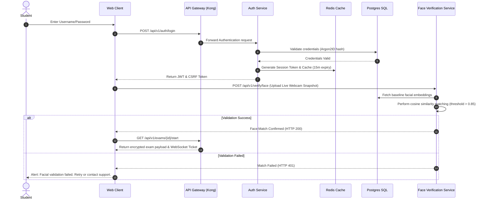

# Software Requirements Specification (SRS) & System Design Document
## Project: Smart Examination and Evaluation Automation Platform (SEEP)

---

## 1. Project Overview

### 1.1 Problem Statement
Educational institutions, universities, schools, and corporate training organizations rely heavily on high-stakes examinations to assess knowledge. However, traditional pen-and-paper exams and first-generation computer-based testing (CBT) systems suffer from critical limitations:
- **High Operational Costs:** Logistics of paper distribution, physical venue rentals, and human invigilator costs are unsustainable at scale.
- **Academic Dishonesty:** Cheating, collusion, and proxy test-takers undermine the credibility of remote exams.
- **Inconsistent & Slow Grading:** Manual evaluation of subjective essays is time-consuming, prone to human bias, and lacks detailed feedback.
- **Rigid Question Setting:** Static question sheets lead to leaks, memorization, and lack of customization for varying difficulty profiles.
- **Lack of Scalability:** Existing systems crash under high concurrent traffic (>100k users), failing to handle resource-constrained network environments.

### 1.2 Project Objectives
The **Smart Examination and Evaluation Automation Platform (SEEP)** aims to resolve these bottlenecks by creating an automated, intelligent, secure, and highly scalable exam lifecycle management platform. The key objectives are:
1. **Security & Integrity:** Implement hybrid, multi-modal AI proctoring (visual, audio, browser control) to eliminate cheating.
2. **AI-Enabled Automation:** Automate question generation via Natural Language Processing (NLP) and automate/assist in subjective grading to expedite evaluation cycles.
3. **Massive Scalability:** Deliver a microservices architecture capable of hosting over **1 million concurrent test-takers** globally with sub-second latency.
4. **Actionable Insights:** Provide deep learning analytics to teachers, administrators, and students to track learning gaps.

### 1.3 Scope
SEEP covers the entire lifecycle of an examination:
```
[User & Course Setup] -> [AI Question Gen & Banking] -> [Secure Scheduling]
         |                                                   |
         v                                                   v
[Results & Analytics] <- [Hybrid Evaluation Engine] <- [Proctored Online Exam]
```

### 1.4 Target Users
- **Administrators:** IT and administrative staff configuring tenants, system defaults, user management, and security protocols.
- **Faculty / Examiners:** Instructors designing curricula, configuring exams, reviewing AI-generated questions, and evaluating subjective answers.
- **Students / Candidates:** Individuals taking mock or high-stakes exams and viewing performance analytics.
- **Auditors / Proctors:** Remote humans reviewing flagging events generated by AI proctoring services.

### 1.5 Expected Outcomes
- **90% reduction** in exam publishing and grading cycles.
- **Zero data loss** during unexpected client-side network disconnects.
- **Scalable throughput** supporting up to 1,000,000 concurrent sessions.
- **Fraud detection accuracy** exceeding 98.5%.

### 1.6 Unique Selling Points (USPs)
- **Multimodal AI Proctoring Edge Integration:** AI models running client-side (via WebAssembly/TensorFlow.js) to minimize server load and bandwidth cost.
- **Rubric-Aligned Semantic Evaluator:** A dual NLP model pipeline evaluating subjective answers for both factual correctness and contextual grammar.
- **Blockchain Credentialing:** Verification of course transcripts and certificates using immutable distributed ledger technology.
- **Offline-First Exam Client:** PWA-based client ensuring exams can continue seamlessly even during a total network dropout of up to 45 minutes.

---

## 2. Functional Requirements

### 2.1 Student Management
- **Profile Configuration:** Students can upload verification documents (e.g., ID cards, bio data) and register biometrics (face templates).
- **Course Enrollment:** Automated enrollment mapping to courses/subjects via CSV import or integration with Student Information Systems (SIS).
- **Personalized Dashboard:** Calendar views of upcoming exams, mock test libraries, and historical performance charts.

### 2.2 Faculty/Examiner Management
- **Course Dashboard:** Performance metrics of student cohorts, distribution curve of grades, and historical logs.
- **Exam Configuration Panel:** Drag-and-drop builder to set examination blueprints (specifying subjects, chapters, cognitive levels, and question types).
- **Manual Override & Grading Console:** View AI-graded subjective answers side-by-side with semantic annotations, adjusting marks and leaving comments.

### 2.3 Administrator Dashboard
- **Tenant Configuration:** Multi-tenancy isolation configuration (custom subdomains, logo branding, and local region database bindings).
- **System Resource Monitor:** Real-time metrics of CPU, memory, concurrent connection counts, and API response latencies.
- **Access Management:** User creation, deletion, role assignment, and IP address whitelisting.

### 2.4 Question Bank Management
- **Hierarchical Classification:** Organize questions by Course -> Subject -> Topic -> Subtopic.
- **Cognitive Level Tagging:** Map questions to Bloom's Taxonomy levels (Remembering, Understanding, Applying, Analyzing, Evaluating, Creating).
- **Question Versioning:** Git-style commit history for question modifications to track changes and roll back revisions.
- **Metadata Tagging:** Tagging of difficulty index, estimated solution time, discrimination index, and media attachments.

### 2.5 AI-Based Question Generation
- **Text-to-Question Extraction:** Upload a textbook chapter, research paper, or lecture slide deck, and specify the count and type of questions needed.
- **Distractor Generation:** Automatically produce semantically plausible but incorrect options for Multiple Choice Questions (MCQs) utilizing semantic vectors.
- **Approval Workflow:** Generated items go to a "Review Queue" for teachers to validate, edit, or reject before publishing to the question bank.

### 2.6 Exam Scheduling
- **Dynamic Slot Booking:** Students select convenient exam slots within a defined window, matching system resource capacities.
- **Resource Allocation Engine:** Automated assignment of active proctors, virtual machines, and test servers based on enrollment load.

### 2.7 Online Examination Module
- **Exam Player Interface:** Clean, distraction-free fullscreen UI displaying the timer, question grid, calculator, and formula sheets.
- **Incremental Cloud Synchronization:** Automatically saves answers client-side to IndexedDB and syncs to backend servers every 10 seconds via encrypted WebSockets.
- **Emergency State Recovery:** If the tab closes, browser crashes, or the computer shuts down, the exam re-authorizes the session and resumes from the last sync point.

### 2.8 Attendance Verification
- **Multi-Factor Bio-Check:** Prior to entry, the system matches a live webcam snapshot with the pre-registered facial database using FaceNet.
- **Dynamic ID Scanning:** OCR verification of institutional ID cards held up to the webcam.

### 2.9 Secure Authentication & Authorization
- **Single Sign-On (SSO):** Integration with Microsoft Azure AD, Google Workspace, and Okta via OAuth 2.0 / SAML.
- **Time-bound Session Tokens:** JWTs issued with short (15-minute) lifetimes and Redis-managed refresh tokens tied to device fingerprints.

### 2.10 Anti-Cheating & Proctoring
- **Device & Browser Lock:** Fullscreen API enforcement. Any attempts to minimize, open new tabs, use keyboard shortcuts (Alt+Tab, Ctrl+C), or connect external monitors triggers warnings and eventual automatic submission.
- **Object & Person Detection:** Real-time YOLOv8 evaluation of webcam frames detecting phones, tablets, secondary displays, or secondary persons.
- **Audio Anomaly Detection:** Audio stream processing to detect voice whispers, structural noises, or dictation using speech-to-text.

### 2.11 Automated Objective Evaluation
- **Instant Processing:** MCQs, multi-select, and fill-in-the-blank questions are evaluated immediately upon submission.
- **Zero-Latency Feed:** Results are buffered into Kafka topics for asynchronous processing, maintaining server responsiveness.

### 2.12 AI-Based Subjective Answer Evaluation
- **Semantic Vector Comparison:** Comparison of student submissions against answer keys using Sentence-BERT cosine similarity.
- **Grammar & Syntax Assessment:** Grading grammatical correctness, readability, and logical cohesion.
- **Rubric Matching:** Scoring broken down by rubric dimensions (e.g., content accuracy, structure, vocabulary).

### 2.13 Result Generation & Grade Calculation
- **Weighted Aggregate Calculation:** Calculation of final scores based on module weightings (e.g., continuous assessment 30%, final exam 70%).
- **Grading Systems:** Support for absolute scales (A-F), relative curves (bell-curve adjustments), and percentile rankings.

### 2.14 Analytics, Reporting & Audit Logs
- **Cohort Analysis:** Detailed statistics showing cohort averages, standard deviation, and standard error.
- **Exporting Options:** One-click PDF transcript printing, CSV dumps, and API payloads matching LTI (Learning Tools Interoperability) parameters.
- **Audit Trails:** Immutable, append-only records of all actions (e.g., `user_logged_in`, `question_modified`, `exam_started`, `proctor_warning_issued`).

---

## 3. Non-Functional Requirements

| Metric | Target / Specification | Justification |
| :--- | :--- | :--- |
| **Concurrency** | 1,000,000+ active users; 100,000 simultaneous writes/sec | Supports large-scale national entrance tests and university final exams. |
| **Latency** | API Response < 200ms (99th percentile); Webhook/Sockets < 100ms | Prevents user frustration and avoids network socket disconnects. |
| **Availability** | 99.99% uptime across active regions | Zero downtime during critical examination weeks. |
| **Data Integrity** | RPO = 0 (no data loss); RTO < 5 minutes | Ensures candidate responses are never lost, even in system failures. |
| **Proctoring BW** | Compression of frames to 15KB; Bandwidth < 150Kbps | Ensures proctoring works over slow 3G/LTE mobile networks. |
| **Compliance** | GDPR (Data Privacy), FERPA (Student Records), WCAG 2.1 AA | Legal mandate for enterprise/institutional deployments. |
| **Accessibility** | Screen-reader compatible, keyboard navigation, high contrast | Mandated to accommodate differently-abled students. |

---

## 4. System Architecture

### 4.1 High-Level Microservices Overview
SEEP uses a highly decoupled Microservices Architecture. Services are written in high-performance **Go** (for transaction-critical paths) and **Python** (for ML/data paths), operating inside a **Kubernetes (EKS)** cluster.

```
                  +----------------------------------------------+
                  |               Web / Mobile Client            |
                  +----------------------+-----------------------+
                                         |
                                         v (HTTPS/WebSockets via CloudFront WAF)
                  +----------------------------------------------+
                  |                 Kong Gateway                 |
                  +----------------------+-----------------------+
                                         |
         +-------------------------------+-------------------------------+
         | (gRPC / Service Mesh)         |                               |
         v                               v                               v
+------------------+            +------------------+            +------------------+
|   Auth Service   |            |   Exam Service   |            | Proctoring Serv. |
| (Go + Redis/PG)  |            | (Go + Redis/PG)  |            | (Python+FastAPI) |
+------------------+            +--------+---------+            +--------+---------+
                                         |                               |
                                         +---------------+---------------+
                                                         | (Async Events)
                                                         v
                                                +-----------------+
                                                |   Kafka Bus     |
                                                +--------+--------+
                                                         |
                                         +---------------+---------------+
                                         |                               |
                                         v                               v
                                +-----------------+            +-----------------+
                                |  Grading Serv.  |            | Analytics Serv. |
                                | (Python + PyT)  |            |  (Go + ClickH)  |
                                +--------+--------+            +--------+--------+
                                         |                               |
                                         v (Artifact Storage)            v
                                   [ AWS S3 / RDS ]               [ Metabase/BI ]
```

### 4.2 Data Flow Diagram (DFD) - Level 1 (Exam & Proctoring Session)
```
[Student Console] ---> (WebSockets) ---> [API Gateway] ---> [Exam Service]
       |                                       |
       | (Webcam/Mic Frames)                   v (Write buffer)
       v                                   [Redis Cache]
[Proctoring Service] ---> (YOLOv8 Edge)        | (Sync)
       |                                       v
       +-----------------------------> [PostgreSQL DB]
       | (Cheating Flags)
       v
  [Kafka Queue] ---> [Proctor Dashboard] (Realtime Alarm)
```

### 4.3 Sequence Diagram: Student Authentication to Exam Entry


---

## 5. Database Design

### 5.1 Normalized Schema Design (3NF)
We use a hybrid storage approach. Transactional models (users, enrollment, schedules, grading records) are stored in **PostgreSQL** for strict ACID compliance. The unstructured Question Bank (which includes nested math equations, options, code blocks, and dynamic tagging) is stored in **MongoDB**. Clickstream logs and proctoring metrics are written to **ClickHouse** for high-volume analytics.

#### PostgreSQL Data Dictionary

```
                                  +---------------+
                                  |     roles     |
                                  +-------+-------+
                                          | 1
                                          |
                                          | 1..*
+---------------+ 1..*          1 +-------v-------+
|   students    +---------------->+     users     |
+---------------+                 +-------+-------+
                                          | 1
                                          |
                                          | 1..*
                                  +-------v-------+
                                  |    teachers   |
                                  +-------+-------+
                                          | 1
                                          |
                                          | 1..*
+---------------+ 1..*          1 +-------v-------+
|    courses    +---------------->+    subjects   |
+---------------+                 +-------+-------+
                                          | 1
                                          |
                                          | 1..*
+---------------+ 1            1..* +-------v-------+
|  evaluations  +<----------------+     exams     |
+---------------+                 +-------+-------+
                                          | 1
                                          |
                                          | 1..*
+---------------+ 1..*          1 +-------v-------+
|    results    +<----------------+    answers    |
+---------------+                 +---------------+
```

##### 1. `users` Table
Stores basic profile information. Sensitive data like passwords are encrypted using Argon2id.
- `id` (UUID, Primary Key)
- `email` (VARCHAR(255), Unique, Indexed)
- `password_hash` (VARCHAR(255))
- `first_name` (VARCHAR(100))
- `last_name` (VARCHAR(100))
- `role_id` (INT, Foreign Key referencing `roles.id`)
- `mfa_secret` (VARCHAR(128), Nullable)
- `status` (VARCHAR(20) - 'ACTIVE', 'SUSPENDED', 'PENDING')
- `created_at` (TIMESTAMP WITH TIME ZONE)
- `updated_at` (TIMESTAMP WITH TIME ZONE)

##### 2. `roles` Table
Enforces Role-Based Access Control (RBAC).
- `id` (INT, Primary Key)
- `name` (VARCHAR(50), Unique - 'ADMIN', 'TEACHER', 'STUDENT', 'AUDITOR')
- `permissions` (JSONB - listing specific capabilities like `["write:questions", "read:results"]`)

##### 3. `students` Table
Extensions specifically related to candidate profiles.
- `id` (UUID, Primary Key, Foreign Key referencing `users.id`)
- `registration_number` (VARCHAR(100), Unique, Indexed)
- `biometric_hash` (TEXT - vector representation of student facial features)
- `enrollment_date` (DATE)

##### 4. `teachers` Table
- `id` (UUID, Primary Key, Foreign Key referencing `users.id`)
- `department` (VARCHAR(100))
- `employee_code` (VARCHAR(50), Unique)

##### 5. `courses` Table
- `id` (UUID, Primary Key)
- `code` (VARCHAR(50), Unique, Indexed)
- `name` (VARCHAR(255))
- `description` (TEXT)

##### 6. `subjects` Table
- `id` (UUID, Primary Key)
- `course_id` (UUID, Foreign Key referencing `courses.id` ON DELETE CASCADE)
- `name` (VARCHAR(255))
- `code` (VARCHAR(50), Unique)

##### 7. `exams` Table
Stores metadata regarding individual testing assignments.
- `id` (UUID, Primary Key)
- `subject_id` (UUID, Foreign Key referencing `subjects.id`)
- `title` (VARCHAR(255))
- `instructions` (TEXT)
- `start_time` (TIMESTAMP WITH TIME ZONE, Indexed)
- `end_time` (TIMESTAMP WITH TIME ZONE, Indexed)
- `duration_minutes` (INT)
- `total_marks` (NUMERIC(5, 2))
- `passing_percentage` (NUMERIC(4, 2))
- `proctoring_config` (JSONB - configs for eye tracking, face detection, tab locks)

##### 8. `answers` Table
Records candidate answers for historical archiving and auto-evaluation.
- `id` (UUID, Primary Key)
- `student_id` (UUID, Foreign Key referencing `students.id`)
- `exam_id` (UUID, Foreign Key referencing `exams.id`)
- `question_id` (VARCHAR(24), Indexed - References MongoDB document id)
- `submitted_answer` (TEXT)
- `is_final` (BOOLEAN, Default False)
- `synced_at` (TIMESTAMP WITH TIME ZONE)

##### 9. `results` Table
Aggregate scores computed post-eval.
- `id` (UUID, Primary Key)
- `student_id` (UUID, Foreign Key referencing `students.id`)
- `exam_id` (UUID, Foreign Key referencing `exams.id`)
- `score_obtained` (NUMERIC(5, 2))
- `grade` (VARCHAR(5))
- `percentile` (NUMERIC(5, 2))
- `status` (VARCHAR(20) - 'PASS', 'FAIL', 'PENDING_REVIEW')
- `published_at` (TIMESTAMP WITH TIME ZONE)

##### 10. `evaluations` Table
- `id` (UUID, Primary Key)
- `answer_id` (UUID, Foreign Key referencing `answers.id`)
- `evaluator_id` (UUID, Nullable, Foreign Key referencing `teachers.id` - if manually overridden)
- `ai_score` (NUMERIC(5, 2))
- `manual_score` (NUMERIC(5, 2), Nullable)
- `final_score` (NUMERIC(5, 2))
- `ai_feedback` (TEXT)
- `evaluation_notes` (TEXT)

##### 11. `audit_logs` Table
Append-only log for structural mutations.
- `id` (BIGSERIAL, Primary Key)
- `user_id` (UUID, Foreign Key referencing `users.id`)
- `action` (VARCHAR(100))
- `ip_address` (INET)
- `user_agent` (VARCHAR(255))
- `payload` (JSONB)
- `created_at` (TIMESTAMP WITH TIME ZONE, Default Now())

### 5.2 Indexing Strategy
To handle more than 1 million users, read-write splitting and query optimization are mandatory:
1. **Composite Indexes:**
   - `CREATE INDEX idx_exams_start_end ON exams(start_time, end_time);` (optimizes search of active schedules)
   - `CREATE INDEX idx_answers_student_exam ON answers(student_id, exam_id);` (accelerates candidate response retrievals)
2. **JSONB Indexing (PostgreSQL):**
   - `CREATE INDEX idx_users_roles_permissions ON users USING gin (role_id, status);`
3. **MongoDB Indexes:**
   - Single field index on `subject_id` + compound index on `{ difficulty: 1, cognitive_level: 1 }` to select random questions matching exam blueprints efficiently.

---

## 6. AI & Machine Learning Features

```
Textual Raw Data (PDF/Text) ---> [ T5 / GPT Generator ] ---> Generated Distractors (WordNet/Cosine)
                                                                 |
                                                                 v
                                                         Validated Questions
```

### 6.1 NLP Question Generation
- **Task Description:** Automatically extract structural questions (MCQs, Short/Long Answers) from unstructured textbooks.
- **Model:** Pre-trained **T5-Base** fine-tuned on the SQuAD v2.0 dataset, or localized API routing to fine-tuned LLMs (e.g., Llama-3-8B-Instruct).
- **Distractor Generation Pipeline:**
  1. Extract key named entities (nouns, phrases) as target answers.
  2. Query WordNet to locate coordinate terms (hyponyms/hypernyms) to serve as distractor candidates.
  3. Filter using Sentence-BERT to ensure distractors are semantically related but objectively incorrect.
- **Evaluation Metric:** METEOR and ROUGE-L scores to measure relevance against manual test suites.

### 6.2 Difficulty Level Prediction
- **Feature Set:** Token length, syntax tree complexity, Flesch-Kincaid grade level, and historical passing rates.
- **Model:** **LightGBM Classifier** categorizing questions into: `EASY`, `MEDIUM`, or `HARD`.
- **Training Process:** Trained on historical student outcome datasets containing over 5 million question-attempt instances.

### 6.3 Automatic Subjective Answer Evaluation
- **Hybrid Pipeline:**
  ```
  Candidate Answer  ---+---> [Sentence Transformer] ---> Cosine Similarity ---> [Weighted Score]
                       |
  Answer Rubric Key ---+---> [Spacy Keyphrase Matching] ---> Token Similarity ------^
  ```
- **Factual Semantic Matcher:** **Sentence-BERT (SBERT)** mapping both the student response ($S$) and model answer key ($M$) into a 768-dimensional space.
  $$\text{Semantic Similarity} = \frac{S \cdot M}{\|S\| \|M\|}$$
- **Rubric Matcher:** Text alignment of key concepts. Spacy NER checks for core formulas, definitions, and keywords.
- **Grammar Scorer:** A lightweight sequence-to-sequence model grading syntactic alignment and spelling structure.
- **Evaluation Metric:** Quadratic Weighted Kappa (QWK) measuring deviation against human grading curves. Aiming for $QWK > 0.88$ (near human-level agreement).

### 6.4 Plagiarism & Copy Detection
- **Code Exams:** Abstract Syntax Tree (AST) comparison using the **MOSS (Measure of Software Similarity)** algorithm to detect renamed variables or structure shifting.
- **Essay Exams:** Shingle-based MinHash and LSH (Locality Sensitive Hashing) matching to cross-check student submissions against other exam entries and public web databases.

### 6.5 Exam Fraud & Risk Analysis
- **Anomaly Detection:** **Isolation Forest** processing aggregated metrics per user session:
  - Tab Switch Count (Frequency per minute).
  - Webcam Absence Flags (Percentage of duration).
  - Audio Volume Variance (Indicating background speaking).
  - Head Pose Yaw/Pitch/Roll deviation (Gaze tracking).
- **Output:** Outputs a threat level from 0.0 (Normal) to 1.0 (Critical). Threat levels exceeding 0.75 flag remote human proctor alerts.

---

## 7. API Design

### 7.1 Authentication (POST /api/v1/auth/login)
- **Method:** `POST`
- **Request Body:**
  ```json
  {
    "email": "student@university.edu",
    "password": "SecurePassword123!",
    "device_fingerprint": "fp_chrome_win_9837aef"
  }
  ```
- **Response Body (Success - 200 OK):**
  ```json
  {
    "status": "success",
    "access_token": "eyJhbGciOiJIUzI1NiIsIn...",
    "expires_in": 900,
    "user": {
      "id": "e290bdf6-3023-4552-b13c-8a2157fb55d0",
      "name": "Jane Doe",
      "role": "STUDENT"
    }
  }
  ```
- **Response (Error - 401 Unauthorized):**
  ```json
  {
    "status": "error",
    "code": "INVALID_CREDENTIALS",
    "message": "The username or password provided is incorrect."
  }
  ```

### 7.2 Exam Session Init (POST /api/v1/exams/{id}/start)
- **Method:** `POST`
- **Headers:** `Authorization: Bearer <JWT_TOKEN>`
- **Request Body:**
  ```json
  {
    "webcam_verification_token": "face_v2_987asfa89"
  }
  ```
- **Response Body (Success - 200 OK):**
  ```json
  {
    "session_id": "87af12-32a8-12cd-8fae",
    "websocket_sync_url": "wss://ws.seep.platform/v1/exams/session/sync",
    "duration_remaining_seconds": 7200,
    "exam_structure": {
      "total_questions": 50,
      "navigation_rules": "FREE"
    }
  }
  ```

### 7.3 Answer Submission Sync (PUT /api/v1/exams/sync)
- **Method:** `PUT`
- **Request Body:**
  ```json
  {
    "session_id": "87af12-32a8-12cd-8fae",
    "answers": [
      {
        "question_id": "60c72b2f9b1d8b23485c212a",
        "answer_text": "Mitosis is a process of cell duplication, or reproduction, during which one cell gives rise to two genetically identical daughter cells.",
        "duration_spent_seconds": 124,
        "is_final": false
      }
    ]
  }
  ```
- **Response Body (Success - 200 OK):**
  ```json
  {
    "status": "synchronized",
    "server_timestamp": "2026-06-23T18:30:00Z"
  }
  ```

### 7.4 AI Grading Feedback Request (POST /api/v1/evaluations/ai-grade)
- **Method:** `POST`
- **Request Body:**
  ```json
  {
    "answer_id": "d76c9a3d-3f0e-436d-961f-9fa16cb2ab12",
    "scoring_rubric": {
      "max_marks": 10,
      "keywords": ["mitosis", "duplication", "chromosomes", "prophase"],
      "weight_semantic": 0.6,
      "weight_grammar": 0.4
    }
  }
  ```
- **Response Body (Success - 200 OK):**
  ```json
  {
    "evaluated_at": "2026-06-23T18:31:05Z",
    "suggested_score": 8.5,
    "breakdown": {
      "semantic_similarity_score": 9.2,
      "keyword_coverage_score": 7.5,
      "grammar_score": 9.0
    },
    "feedback": "The answer provides a strong description of cellular replication. However, it omitted structural references to chromosome splitting phases (prophase, metaphase)."
  }
  ```

---

## 8. User Interface Design

```
+-------------------------------------------------------------+
| [SEEP Logo]   Exam: Biology 101 | Timer: 01:45:22 | [Face Check]
+-------------------+-----------------------------------------+
| Question 12 of 50 |                                         |
| Explain mitosis.  | [ Question Palette ]                    |
|                   | [1] [2] [3] [4] [5] [6] [7] [8] [9] [10] |
| [ Text Area     ] | [11] [*12*] [13] [14] [15]              |
|                   |                                         |
| [Prev] [Next]     | Legend: [x] Done  [ ] Unread  [*] Flag  |
+-------------------+-----------------------------------------+
```

### 8.1 Student Portal Layout
- **Minimalist Exam Mode:** Full-viewport, dark-themed canvas optimizing concentration.
- **Dynamic Palette:** A side-grid visual indicator representing:
  - Green: Answered.
  - Orange: Flagged for review.
  - Grey: Unvisited.
- **Top Bar Diagnostics:** Displays network connection status (Green = Online, Amber = Slow, Red = Local Buffer Active), system time remaining, and local feed check of webcam stream.

### 8.2 Teacher Dashboard Layout
- **Split-Pane Assessment Console:**
  - *Left Pane:* Candidate's raw essay submission with highlight overlays for grammatical mistakes and core concepts.
  - *Right Pane:* AI Evaluation Recommendations, showing similarity scores, matched keywords, and dynamic comment inputs.
- **Question Configurator:** Rich-text fields supporting LaTeX expressions for mathematical and chemical symbols.

---

## 9. Security Framework

### 9.1 Network & Session Security
- **OAuth 2.0 / JWT:** Tokens signed using RS256 private keys, matching validation checks at Kong API Gateways using public keys.
- **Session Fingerprint Binding:** The server stores hash vectors matching `IP` + `OS` + `Browser Engine` inside Redis. Any mid-session changes immediately terminate WebSocket connections.

### 9.2 Data Protection & Storage Encryption
- **Database Level Security:** Column-level encryption for identifiers and grade statistics using PGP sym keys via `pgcrypto`.
- **Object Storage Access Control:** AWS S3 buckets containing ID card snapshots use Object Lock configured in compliance-mode. Access is permitted strictly via ephemeral AWS IAM Signed URLs.

### 9.3 Client-Side Invigilation & Browser Lock (Anti-Cheating)
- **Edge Inference:** TensorFlow.js runs in an isolated Web Worker to monitor camera feeds local to the browser. Only metadata anomalies are transmitted, minimizing server bandwidth.
- **API Guardrails:** Enforce focus blur hooks:
  ```javascript
  window.addEventListener('blur', () => {
    // Record event to telemetry, decrement warning budget, notify user
    triggerCheatingTelemetry('WINDOW_FOCUS_LOST');
  });
  ```

---

## 10. Technology Stack

```
           [ Frontend Client ] React / Next.js / TypeScript
                                  |
                                  v
            [ Backend Core ] Go (Golang) + Python (FastAPI/AI)
                                  |
            +---------------------+---------------------+
            |                                           |
            v                                           v
[ Relational Engine ] PostgreSQL           [ Document & Cache ] MongoDB / Redis
```

- **Frontend Core:** **Next.js & TypeScript**
  *Justification:* Provides Static Site Generation (SSG) for static login blocks alongside highly interactive single-page application (SPA) paths for active testing consoles.
- **Backend Services:** **Go (Golang)**
  *Justification:* Stateless compiled language offering high concurrency and minimal memory footprint, essential for routing high volume API calls from 1 million concurrent clients.
- **Intelligent Pipelines:** **Python (FastAPI)**
  *Justification:* Integrates natively with PyTorch, Transformers, and OpenCV pipelines without cross-process IPC delays.
- **Relational Databases:** **PostgreSQL**
  *Justification:* Native JSONB support combined with high transaction control (ACID) ensures correct ledger balances on student achievements.
- **Key-Value Store:** **Redis Cluster**
  *Justification:* Used for sub-millisecond API rate limiting, global websocket state directories, and active session tokens.
- **DevOps & Infrastructure:** **Docker, Kubernetes (EKS), Terraform**
  *Justification:* Automated provisioning of infrastructure and microservices scaling driven by custom resource profiles.

---

## 11. Development Roadmap

### 11.1 Phase-wise Milestones
```
Phase 1: Foundation (M1-M2)   ========> Core DB Schemas, IAM, Auth Microservice
Phase 2: Core Platform (M3-M4) ========> Question Bank, Exam Scheduler, Student Portal
Phase 3: AI & Proctoring (M5-M6) ======> SBERT Grading, WebAssembly YOLO Invigilation
Phase 4: Optimization (M7-M8) =========> Load testing, Security Audits, Deployment
```

### 11.2 Sprint Breakdown (Example: Sprint 3 - Exam Player UI & WebSocket Sync)
- **Goal:** Develop the offline-capable exam player.
- **Sprint Items:**
  - Build UI layouts for the MCQ/Subjective player modules (React + Tailwind).
  - Implement IndexedDB local buffers for incremental answer saves.
  - Implement WebSocket notification handling (Go backend + Gorilla Websockets).
  - Write unit/integration tests confirming local state restoration upon browser recovery.

### 11.3 Risks & Mitigations
- **System Failure During Exam:**
  *Mitigation:* Local persistence (IndexedDB) logs every answer change. If the server goes offline, local timers run offline, and data is synced to the database once the connection is restored.
- **AI Bias in Grading:**
  *Mitigation:* AI grading recommendations are first presented to teachers. Any modifications override the AI output, and the corrections are fed back into training pipelines for continuous learning.

---

## 12. Testing Strategy

### 12.1 Automated Unit & Integration Testing
- **Go Microservices:** standard `testing` framework targeting >85% code coverage.
- **Python Pipelines:** PyTest validating model accuracy on standardized grading test sets.

### 12.2 Performance & Load Testing
- **Tooling:** **k6 / JMeter**
- **Test Scenarios:** Simulate 100k requests/second during student login windows. Verify load balancing across RDS read replicas.

### 12.3 AI Validation & Metrics
- **Objective:** Evaluate AI subjective score deviation against manual evaluations.
- **KPI:** Maintain Mean Absolute Error (MAE) under 0.05 on normalized grading intervals.

---

## 13. Deployment Strategy

### 13.1 Production Deployment Manifest Example (Kubernetes Deployment)
```yaml
apiVersion: apps/v1
kind: Deployment
metadata:
  name: exam-engine-deployment
  namespace: seep-prod
  labels:
    app: exam-engine
spec:
  replicas: 10
  selector:
    matchLabels:
      app: exam-engine
  template:
    metadata:
      labels:
        app: exam-engine
    spec:
      containers:
      - name: exam-engine
        image: 123456789012.dkr.ecr.us-east-1.amazonaws.com/seep/exam-engine:v1.2.0
        ports:
        - containerPort: 8080
        envFrom:
        - secretRef:
            name: exam-engine-secrets
        resources:
          limits:
            cpu: "2"
            memory: 4Gi
          requests:
            cpu: "500m"
            memory: 1Gi
        readinessProbe:
          httpGet:
            path: /healthz
            port: 8080
          initialDelaySeconds: 15
          periodSeconds: 10
        livenessProbe:
          httpGet:
            path: /healthz
            port: 8080
          initialDelaySeconds: 30
          periodSeconds: 20
```

### 13.2 CI/CD Deployment Flow
```
[Git Push (main)] -> [GitHub Actions Build] -> [Docker Image ECR push] -> [Helm Upgrade EKS] -> [Prometheus Alerts]
```

---

## 14. Future Enhancements

- **Generative AI Examiners:** Interactive oral exams conducted by AI avatars, evaluating answers in real time.
- **Blockchain Credentials:** Storing digital certificates on decentralized public ledgers (e.g., Ethereum/Hyperledger) to simplify verification for employers.
- **Computerized Adaptive Testing (CAT):** Dynamically adjusting question difficulty based on student response patterns to assess knowledge levels with fewer questions.
